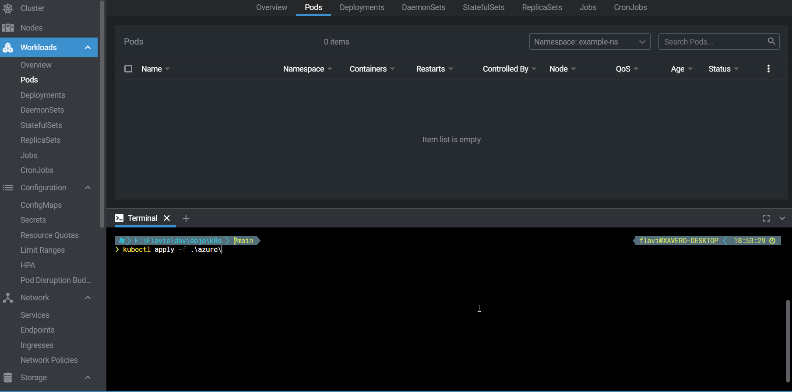

# Kubernetes (k8s) #

Esse repositório possui alguns exemplos e links para começar a estudar sobre Kubernetes - também abreviado como k8s

> :warning: **NÃO USAR OS EXEMPLOS EM PRODUÇÃO!**

## Pré-requisitos ##
- Docker Desktop com Kubernetes [ativado](https://docs.docker.com/docker-for-windows/#kubernetes)
- [Helm](https://helm.sh/docs/intro/install/) para instalação de programas no cluster

## TL;DR ##
```powershell
# Infra estrutura básica de monitoramento (prometheus) e ingress (proxy http,necessário ter a porta 80 livre)
# Testado com o k8s no Docker Desktop

./infra/install-local.ps1
```

```powershell
# Deploy de pods no Docker Desktop. 
#     Acessar via http://example.127-0-0-1.nip.io/weatherforecast

kubectl apply -f ./local
```

```powershell
# Teste de carga para ver o Autoscale em ação

kubectl apply -f ./load_test
```

## Funcionalidades do k8s ##

- Rolling update
- Self-Healing
- Autoscale
- Load Balance
- Orquestração de Storage 
- Configuração pode ser guardada com git
- Api Rest

## Usando o k8s localmente ##

É possível habilitar o k8s no [Docker Desktop](https://docs.docker.com/docker-for-windows/#kubernetes) para testar localmente.
Administração do k8s poder feita no prompt de comando com o comando ```kubectl``` ou via interface gráfica.

Interfaces gráficas que podem ser usadas com o k8s:
- https://k8slens.dev/
- https://github.com/kubernetes/dashboard
- https://github.com/vmware-tanzu/octant
- https://www.kubernetic.com/
- https://k9scli.io/
- https://docs.kubenav.io/

## Conceitos básicos ##

### Node ###
- Cada servidor do cluster k8s que pode executar suas aplicações
- Os servidores com os componentes de controle do cluster (api, manager, scheduler, etc) normalmente não devem executar suas aplicações (Workloads)

### Pods ###
- Responsável por executar a sua aplicação!
- Menor unidade que o k8s controla
- Uma aplicação por Pod!
- Configuração de configuração, segredos, healthcheck, volumes, limites de memória, cpu, volumes, etc.
- O Pod normalmente só tem 1 container, porém é possível subir outros  containers no mesmo Pod. Exemplos:, service mesh, Reload de Configuração, Proxy, Controle de Acesso (Autenticação), etc)

### Deployment ###
- Controla a quantidade de Pods da aplicação (Replicas)
- Estratégia de atualização automática (Rolling ou Replace)
- Rollback com um comando!

### Services ###
- LoadBalance entre os Pods e expor o Pod para outras aplicações dentro do cluster k8s.
- DNS fixos/previsíveis (é o próprio nome do service)
- Redirecionamento de porta
- Expor Pods externamente via NodePort ou LoadBalancer

### Ingress ###
- Expõe aplicações Web via proxy reverso do k8s (nginx, haproxy, istio, ambassador, etc)
- Alterações e novos arquivos são detectadas automaticamente pelo proxy
- Suporte a mais de um proxy no mesmo cluster (interno, externo, dev, prod, etc)
- Roteamento por hostname e/ou path
- Todas as outras funcionalidades de proxy via anotações e configMap (específico de cada proxy)

### Persistent Volumes (PV) e Persistent Volume Claim (PVC) ###
- Conectar Pods a Storage (Azure Disk, Azure Files, nfs, Smb, Disco Local)
- Existem plugins para usar diversas soluções de storage distribuído: Ceph, glusterfs, iSCSI, VsphereVolume, Rook, etc

### StatefulSets ###
- Todas as configurações do Deployment
- Cria pods com nomes previsíveis (pod-0, pod-1, pod-2, etc)
- Garante deployment e update em ordem
- Muito usado com aplicações que trabalham em cluster (ex: rabbitmq, elasticsearch, mongodb, etc)

### DaemonSet ###
- Instancia um Pod da aplicação em cada Node do cluster
- Todas as outras configurações do Deployment
- Normalmente usado com aplicações de infra como coletores com logs, plugins de rede ou de storage

### Comandos úteis ###

```powershell
# Aplicar uma configuração de um objeto no cluster k8s - deploymnet, service, ingress, etc)
kubectl apply -f .\deployment.yaml

# listar os pods em execução
kubectl get pods
kubectl get pods -o wide
kubectl get pods -n outro-namespace

# logs dos containers no pod
kubectl logs nome-pod

# abrir um console dentro do container principal do pod
kubectl exec -it nome-pod bash

# rollback de um deployment
kubectl rollout undo deployment/nome-deployment

# remover objetos do cluster usando o mesmo arquivo
kubectl delete -f .\deployment.yaml

# remover objetos do cluster usando o nome
kubectl delete deployment nome-deployment
kubectl delete service nome-service
```

## Arquivos de Demonstração ## 

Exemplos preparados para usar com o k8s do Docker Desktop. Pode ser necessário ajustes para usar em outros clusters.
Por exemplo, na Azure não é necessário instalar o metrics server.

### Preparar infraestrutura ###

Instalação do stack de monitoramento de memória, cpu, rede e etc (Prometheus, Grafana e [Metrics Server](https://github.com/kubernetes-sigs/metrics-server))

```powershell
./infra/install-local.ps1
```

### Deployment de Pods de Exemplos ###

```powershell
# Deploy de pods no Docker Desktop. 
#   Acessar via http://example.127-0-0-1.nip.io/weatherforecast
#   Para quebrar o site e ver o k8s reiniciar o pod automaticamente, 
#   usar a url http://example.127-0-0-1.nip.io/break

kubectl apply -f ./local
```

### Autoscale ###

O objeto [HorizontalPodAutoscaler](local/06_autoscale.yaml) informa quais métricas o k8s deve usar para aumentar ou diminuir a quantidade de Pods da aplicação automaticamente.
Em ambiente Cloud, o k8s pode também aumentar ou diminuir a quantidade de Nodes no cluster automaticamente, se não houver espaço nos Nodes já provisionados.

```powershell
# Deploy de Job para simular carga na aplicação
#
kubectl apply -f ./load_test
```



## Links Úteis ##
- https://kubernetes.io/docs/home/
- https://docs.microsoft.com/en-us/azure/aks/kubernetes-walkthrough
- https://helm.sh/
- https://ramitsurana.gitbook.io/awesome-kubernetes/
- https://collabnix.github.io/kubelabs/
